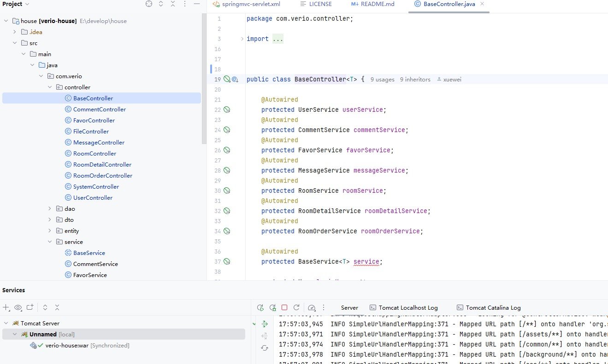
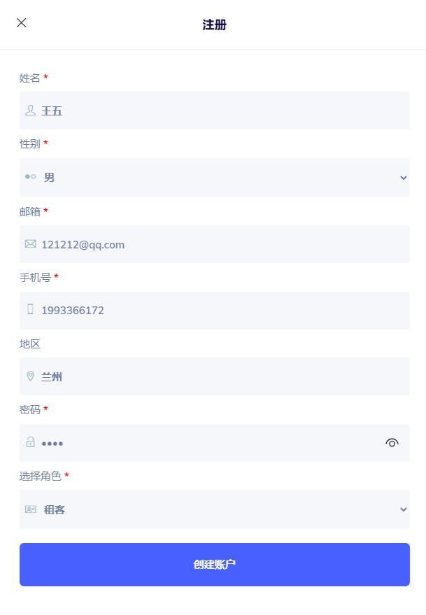
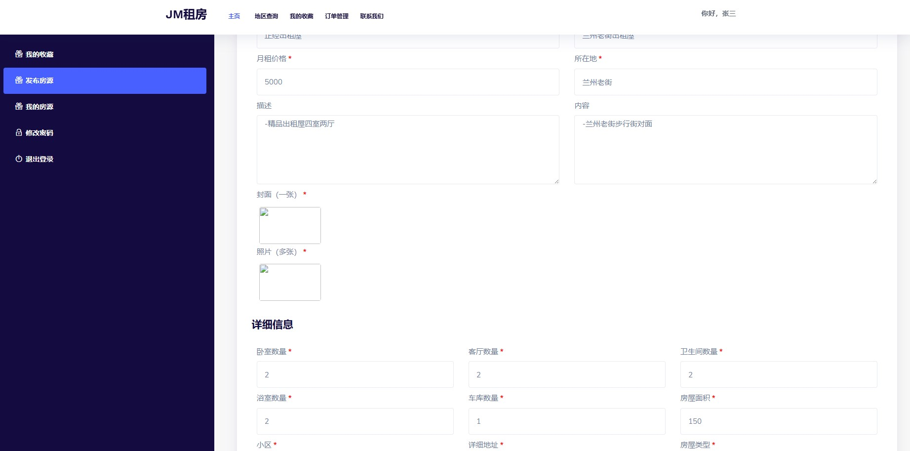
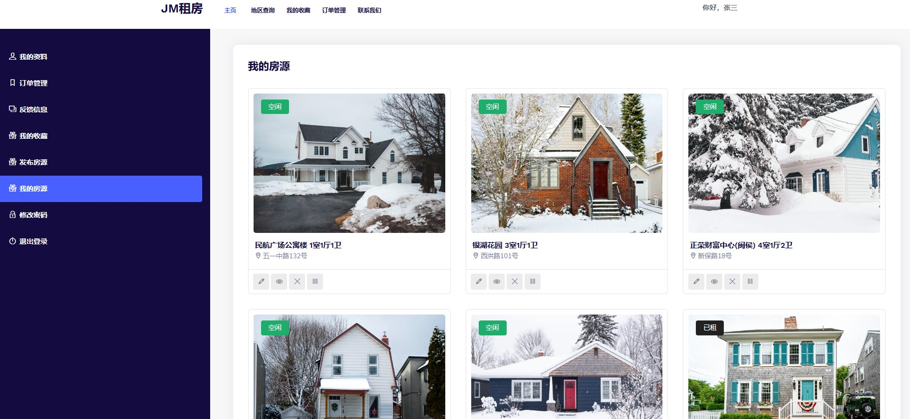

## 项目介绍

房屋租赁系统（verio_house）是一个基于 SSM 开发的标准 Java Web 项目。整体页面非常的简约大气（个人觉得我设计的页面还是非常的
Beautiful）。整体项目的完整度较高，但是当时没有花精力去对接支付系统，所以支付订单的功能是假的，不过还是可以形成业务闭环。非常适合刚刚接触学习
Spring 的技术小白学习，也非常适合学校中的项目答辩或者毕业设计。

### 角色介绍

系统共设计了三个角色：游客、房东、租客。当时考虑的比较简单，没有设置系统管理员的角色，反正对于一些小项目而且也够用了。

1. 游客：尚未进行注册和登录。具备登录注册、房源的搜索、查询详情等权限。
2. 房东：用户角色为房东，有出租房屋需求的群体。具备登录、个人资料的修改、登录密码修改、房源的搜索、查询详情、房源的收藏、查看租房订单、取消订单、房源信息的发布、房源信息的查询管理、房源状态的管理、反馈信息的处理等权限。
3. 租客：用户角色为租客，有租房需求的群体。具备登录、个人资料的修改、登录密码修改、房源的搜索、查询详情、房源的收藏、创建租房订单、取消订单、删除订单、支付、房源评价、反馈信息的填报等权限。

### 功能介绍

#### 游客功能介绍

| 功能模块   | 功能描述                         |
|--------|------------------------------|
| 登录注册方面 | 注册成为系统用户                     |
| 系统主页   | 浏览系统主页、房源信息搜索、房源详情的查看（统计浏览量） |

#### 房东功能介绍

| 功能模块   | 功能描述                                    |
|--------|-----------------------------------------|
| 登录注册方面 | 填写用户信息进行账号注册、使用邮箱密码进行登录                 |
| 个人资料方面 | 修改个人资料（姓名、所在地、邮箱、手机号、身份证号、个人说明等）、修改登录密码 |
| 订单管理方面 | 查看所有订单、订单详情、取消订单、删除订单                   |
| 发布房源   | 填写基本信息、填写详细信息、上传封面图片以及房屋照片              |
| 房源信息管理 | 自己已发布的房源信息、编辑房源、删除房源、暂停发布、启动发布、租期到期     |
| 反馈信息方面 | 查询所有反馈信息、反馈信息搜索、删除反馈、处理反馈               |
| 收藏管理方面 | 查询所有收藏信息、收藏信息搜索、取消收藏                    |
| 系统主页   | 浏览系统主页、房源信息搜索、房源详情的查看（统计浏览量）、收藏房源       |

#### 租客功能介绍

| 功能模块   | 功能描述                                      |
|--------|-------------------------------------------|
| 登录注册方面 | 填写用户信息进行账号注册、使用邮箱密码进行登录                   |
| 个人资料方面 | 修改个人资料（姓名、所在地、邮箱、手机号、身份证号、个人说明等）、修改登录密码   |
| 订单管理方面 | 查看所有订单、创建订单、支付订单（假支付）、订单详情、取消订单、删除订单、评论房源 |
| 反馈信息方面 | 反馈信息、查询所有反馈信息、反馈信息搜索、查询详情以及处理意见           |
| 收藏管理方面 | 查询所有收藏信息、收藏信息搜索、取消收藏                      |
| 系统主页   | 浏览系统主页、房源信息搜索、房源详情的查看（统计浏览量）、收藏房源         |

## 技术介绍

### 前端

| 名称                | 描述                                                      |
|:------------------|---------------------------------------------------------|
| HTML、CSS          | 用于设计网页的内容和样式                                            |
| JavaScript、JQuery | 作为开发 Web 页面的脚本语言，为网页添加各式各样的动态功能，为用户提供更流畅美观的浏览效果         |
| Bootstrap         | 基于 HTML、CSS、JavaScript 开发的简洁、直观、强悍的前端开发框架，使得 Web 开发更加快捷 |
| 前端模板              | 房屋租赁系统模板 Verio，模板文件已放在项目目录下                             |

### 后端

| 名称           | 描述                                                                                                                                                                                                                                |
|--------------|-----------------------------------------------------------------------------------------------------------------------------------------------------------------------------------------------------------------------------------|
| Spring       | Spring 是 Java EE 编程领域的一个轻量级开源框架，该框架由一个叫 Rod Johnson 的程序员在 2002 年最早提出并随后创建，是为了解决企业级编程开发中的复杂性，实现敏捷开发的应用型框架。Spring 是一个开源容器框架，它集成各类型的工具，通过核心的 Bean factory 实现了底层的类的实例化和生命周期的管理。在整个框架中，各类型的功能被抽象成一个个的 Bean，这样就可以实现各种功能的管理，包括动态加载和切面编程。 |
| SpringMVC    | Spring MVC 属于 SpringFrameWork 的后续产品，已经融合在 Spring Web Flow 里面。Spring 框架提供了构建 Web 应用程序的全功能 MVC 模块。                                                                                                                                  |
| MyBatis Plus | MyBatis-Plus（简称 MP）是一个 MyBatis 的增强工具，在 MyBatis 的基础上只做增强不做改变，为简化开发、提高效率而生。                                                                                                                                                         |
| Thymeleaf    | Thymeleaf 是一个流行的模板引擎，该模板引擎采用 Java 语言开发的，用于渲染 XML/XHTML/HTML5 内容的模板引擎。类似 JSP、Velocity、FreeMaker 等，它也可以轻易的与 Spring MVC 等 Web 框架进行集成作为 Web 应用的模板引擎。                                                                                  |
| Druid        | Druid 是一个高效的数据查询系统，主要解决的是对于大量的基于时序的数据进行聚合查询。数据可以实时摄入，进入到 Druid 后立即可查，同时数据是几乎是不可变。通常是基于时序的事实事件，事实发生后进入 Druid，外部系统就可以对该事实进行查询。                                                                                                      |

### 开发工具与环境

- **开发工具**

    - IntelliJ IDEA 2024.1.4 主要进行系统的开发、系统调试等
        - 使用到的插件
            - Lombok：使用注解代替在实体类中添加的 get、set方法、toString 方法等
    - WebStorm 2019.2.1 主要进行前端页面的开发。
    - Navcat 主要进行数据库的连接、建库建表、系统调试等。

- **开发环境**

    - JDK 1.8
    - Maven 3
    - MySQL 5.7
    - Tomcat 8.5.100

- **阿里云 OSS 对象存储**

  阿里云对象存储 OSS（Object Storage Service）是一款海量、安全、低成本、高可靠的云存储服务，对于我们这个项目而言，所有的二进制文件，包括头像、用户上传的文件都是存储到了
  OSS 里面（调用相关的工具类），在数据库中只是保存了文件的 URL 地址。通过这个 URL 地址就可以获取、下载指定文件。

## 项目结构

本项目使用标准 SSM 目录结构，后端使用 MVC 三层架构，具体项目结构如下：

- src：源码目录
- src/main/java：源码主体目录
- src/main/java/xxx/component：java常用组件存放地址，比如登录拦截器【拦截器】
- src/main/java/xxx/controller：java控制器类存放地址【控制层】
- src/main/java/xxx/entity：java实体类存放地址【模型】
- src/main/java/xxx/dao：MyBatis的映射接口存放地址，【数据访问层】
- src/main/java/xxx/service：java业务层接口存放地址【业务逻辑抽象层】
- src/main/java/xxx/utils：java工具类存放地址【工具类】
- src/resources：资源文件存放目录（Spring、SpringMVC、Mybatis、日志、数据源、数据库脚本等）
- src/main/resources/mybatis：MyBatis配置文件位置
- src/main/resources/mybatis/mybatis-config.xml：MyBatis全局配置文件
- src/main/resources/spring/applicationContext.xml：Spring配置文件
- src/main/resources/springmvc/springmvc-servlet.xml：Spring配置文件
- src/main/resources/db.properties：数据源配置
- src/main/resources/log4j.properties：日志配置
- src/main/resources/verio_house.sql：数据库脚本
- src/main/webapp/resource：前端静态资源存放地址
- src/main/webapp/WEB-INF/templates：前端页面存放地址
- src/main/webapp/WEB-INF/web.xml：Java EE工程文件
- pom.xml：Maven项目依赖管理文件

> 部署项目，需要修改两个文件：
>
> 1. 数据库配置文件：src/main/resources/db.properties
> 2. 阿里云对象存储配置：src/main/java/com/verio/utils/OssUtil.java
>
>  MySQL 的版本是 5.7，使用其它版本可能会出现其它未知问题。

## 系统截图

### 系统主页

### 系统注册

### 房源搜索

### 浏览房源

### 发布房源

### 我的房屋

### 支付页面

